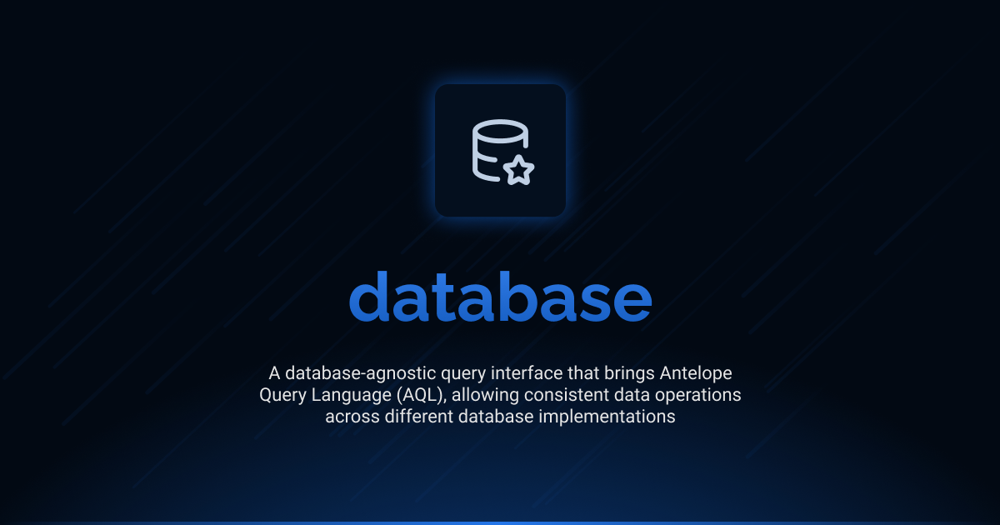

# Interface Database

<div align="center">
<a href="./LICENSE"></a>
<a href="https://discord.gg/sjK28QHrA7"></a>
<a href="./docs/index.md"></a>
</div>

A database-agnostic query interface that provides consistent operations across different database implementations. Interface Database brings AQL (Antelope Query Language) to your projects, enabling you to write database code that works with multiple database backends.

## Installation

```bash
ajs module imports add database@beta
```

## Documentation

Detailed documentation is available in the `docs` directory:

- [Index](./docs/index.md) - Overview and documentation structure
- [Query Types](./docs/1.query_types/1.index.md) - Information about table, selection, and other query types
- [Operations](./docs/2.operations/1.index.md) - Database, table, and CRUD operations
- [Results](./docs/3.results/1.index.md) - Result types and handling

## Inspiration

Interface Database is heavily inspired by [ReQL](https://rethinkdb.com/docs/introduction-to-reql/), the query language of [RethinkDB](https://rethinkdb.com/). As huge fans of ReQL's elegant chainable API and its ability to express complex queries in a native javascript like language format, we've adopted many of its design principles while expanding the concept to work with multiple database backends.

## Current Status

This is the development version (`beta`) of the Interface Database. It is currently in pre-release stage and may undergo changes before the final release. The interface is not considered stable for production use without understanding that breaking changes may occur.

## Versions

| Version | Link                                                                                              | Status                                        |
| ------- | ------------------------------------------------------------------------------------------------- | --------------------------------------------- |
| beta    | [database@beta](https://github.com/AntelopeJS/rethinkdb/tree/main/.antelope/output/database/beta) | Waiting validation from community to go in v1 |
| 1       | _Not yet released_                                                                                | Planned stable release                        |

## License

This project is licensed under the Apache License 2.0 - see the [LICENSE](LICENSE) file for details.
