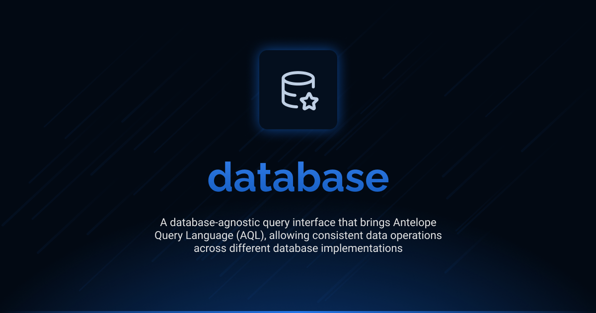

# Interface Database

<div align="center">
<a href="https://www.npmjs.com/package/@antelopejs/interface-database"></a>
<a href="./LICENSE"></a>
<a href="https://discord.gg/sjK28QHrA7"></a>
<a href="./docs/index.md"></a>
</div>

A database-agnostic query interface that provides consistent operations across different database implementations. Interface Database brings AQL (Antelope Query Language) to your projects, enabling you to write database code that works seamlessly with multiple database backends through a chainable, type-safe API inspired by ReQL.

## Installation

```bash
npm install @antelopejs/interface-database
```

## Documentation

Detailed documentation is available in the `docs` directory:

- [Overview](./docs/index.md) - Introduction and documentation structure
- [Query Types](./docs/1.query_types/1.index.md) - Table, Selection, Stream, Datum, ValueProxy, and other query types
- [Operations](./docs/2.operations/1.index.md) - Schema management, CRUD operations, filtering, and lookups
- [Results](./docs/3.results/1.index.md) - Result types and change feed handling

## License

This project is licensed under the Apache License 2.0 - see the [LICENSE](LICENSE) file for details.
